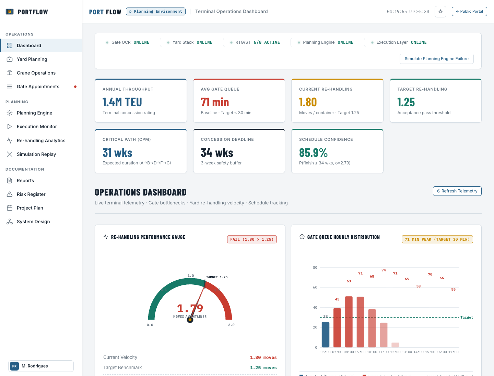

# PortFlow – Container Terminal Yard & Gate Operations System

> **Software Engineering Capstone Case Study & Operational Control System**  
> *A high-throughput container terminal planning and real-time execution platform engineered for a **1.4 Million TEU/Year** facility.*

---

## 🏗️ Software Engineering Overview (SOE Explanation)

### 1. Problem Context & Industrial Engineering Motivation
Modern container transshipment and gateway terminals operate under severe physical and economic constraints. In this case study facility handling **1.4 million TEU (Twenty-foot Equivalent Units) annually**, manual coordination and uncoupled planning create severe operational bottlenecks:
1. **71-Minute Peak Gate Queue**: Walk-in truck arrival patterns lead to severe congestion at gate OCR lanes, idle tractor-trailers, and terminal access penalties.
2. **Excessive Unproductive Re-handling (1.80 moves/container)**: Stacking import and export containers without considering downstream departure windows forces Rubber-Tyred Gantry (RTG) cranes to repeatedly reshuffle upper containers to retrieve lower ones (the classic "buried container" problem).
3. **Rigid Concession Schedule & Financial Penalties**: The operational concession agreement establishes a hard **34-Week Go-Live Deadline** with liquidated damages of **₹12 Lakh per week of operational delay**.
4. **Coupled Systems Failure Risk**: Real-time operational surprises (e.g., crane breakdowns, delayed truck arrivals) routinely invalidate static offline yard plans if planning and execution are tightly coupled.

---

### 2. Core Software Engineering Decisions & System Architecture
PortFlow resolves these operational bottlenecks through four foundational architectural decisions:

```
┌────────────────────────────────────────────────────────────────────────────────────────┐
│                                  PORTFLOW ARCHITECTURE                                 │
└────────────────────────────────────────────────────────────────────────────────────────┘

    [ TRUCK APPOINTMENT SYSTEM (TAS) ]                [ REAL-TIME TERMINAL I/O ]
           │ (Hourly Arrival Caps)                         │ (Gate OCR, RTG Sensors)
           ▼                                               ▼
┌───────────────────────────────────────┐       ┌────────────────────────────────────────┐
│           PLANNING ENGINE             │       │         EXECUTION MONITOR              │
│       (Offline Optimization)          │       │        (Real-Time Engine)              │
│ ───────────────────────────────────── │       │ ────────────────────────────────────── │
│ • Departure-Priority Stacking         │       │ • Live Work-Order Dispatching          │
│ • Heuristic Relocation Minimizer      │       │ • Dynamic Re-sequencing & Exception    │
│ • Work-Order Batch Optimization       │◄──────┤   Handling (Tolerates Plan Deviation)  │
└──────────────────┬────────────────────┘       └──────────────────┬─────────────────────┘
                   │                                               │
                   ▼                                               ▼
    [ OPTIMIZED YARD TARGET ALLOCATION ]        [ LIVE TELEMETRY & EVENT STREAM ]
                   │                                               │
                   └───────────────────────┬───────────────────────┘
                                           │
                                           ▼
┌────────────────────────────────────────────────────────────────────────────────────────┐
│                            UNIFIED WEB CONTROL DASHBOARD                               │
│        (Light/Dark Theme Industrial Control Room · Responsive Responsive Grids)        │
└────────────────────────────────────────────────────────────────────────────────────────┘
```

#### A. Strict Separation of Planning and Execution
- **The Planning Engine** computes mathematically optimized stacking allocations and crane sequences offline based on manifest data and departure schedules.
- **The Real-Time Execution Monitor** operates independently on live operations telemetry. If a crane fails or a truck arrives off-schedule, the execution layer dynamically dispatches local adjustments without crashing or invalidating the master yard model.

#### B. Departure-Priority Reverse Stacking
- Containers leaving soonest ($< 24\text{ hours}$) are positioned on topmost tiers, while long-dwell and transshipment boxes are staged on bottom tiers.
- Reduces unproductive reshuffling moves from the baseline of **1.80 moves/container down to the target benchmark of $\le 1.25$ moves/container** (a 44% reduction in non-revenue crane cycles).

#### C. Time-Windowed Gate Appointments (TAS)
- Fixed hourly appointment slots replace walk-in queuing, capping peak truck arrival surges to terminal capacity.
- Flattens peak truck wait times from **71 minutes down to the 30-minute target threshold**.

#### D. Three-Year Historical Replay Acceptance Validation
- Software acceptance is governed by rigorous automated validation against **3 years of historical terminal transaction logs**. Go-live sign-off mandates that simulated re-handling velocity remain $\le 1.25$ moves/container over actual terminal datasets.

#### E. CPM / PERT Schedule Engineering
- **Expected Duration ($T_e$)**: 31.0 weeks along the critical path ($A \rightarrow B \rightarrow D \rightarrow F \rightarrow G$).
- **Concession Hard Deadline**: 34.0 weeks.
- **Variance ($\sigma$)**: 2.79 weeks.
- **Confidence**: **$P(T \le 34\text{ weeks}) = 85.9\%$**, with pre-engineered activity crashing trade-offs to protect concession buffers.

---

## 🖥️ Operational Control Room Interface

The PortFlow frontend is designed as a **spacious, enterprise-grade operations control system** with rich visual hierarchy, generous whitespace, and a high-contrast industrial aesthetic.

### Dashboard Overview (1440px Desktop)


### Key Screens & Visual Modules

| Module | Purpose & Visual Layout | Preview |
|---|---|---|
| **Operations Dashboard** | 4-column KPI overview, $320\text{px}$ Gate Queue hourly distribution chart, animated Semicircular Re-handling Gauge, full-width Yard Overview, and Live Incident alerts. | [View Dashboard](screenshot_1440_dashboard_full.png) |
| **Yard Planning** | Full planning board with departure-priority color-coded container blocks ($76\text{px} \times 48\text{px}$ containers, corrugated textures, stack inspection, and occupancy stats). | [View Yard](screenshot_1440_yard.png) |
| **Crane Operations** | Fleet telemetry with 3-column crane cards grid, live efficiency gauges, moves/hr velocity, and work-order sequence timeline. | [View Crane](screenshot_1440_crane.png) |
| **Gate Appointments** | 24-hour time-slot capacity timeline ($88\text{px}$ slot cards), appointment volume summary, real-time filters, and truck queue table. | [View Gate](screenshot_1440_gate.png) |
| **Risk Register** | Risk mitigation matrix with severity badges, mitigation ownership, and comfortable $54\text{px}+$ row heights. | [View Risk](screenshot_1440_risk.png) |
| **Public Landing Page** | Enterprise portal with hero animation, dark navy KPI summary strip, and platform capability grid. | [View Landing](screenshot_1440_landing.png) |

---

## 📊 Formal Engineering Reports & Deliverables

All formal software engineering reports, requirements specifications, architectural diagrams, test suites, and project management artifacts are compiled in the [`/report files`](./report%20files/) directory:

1. 📄 [**01. PERT / CPM & Schedule Crashing Report** (`01_PERT_CPM_Crashing_Report.pdf`)](./report%20files/01_PERT_CPM_Crashing_Report.pdf)  
   *Activity network diagram, variance calculations, normal vs crashed durations, slope analysis, and penalty trade-offs.*
2. 📄 [**02. Software Requirements Specification (SRS)** (`02_SRS.pdf`)](./report%20files/02_SRS.pdf)  
   *IEEE 830-compliant requirements, functional & non-functional requirements, acceptance metrics, and user stories.*
3. 📄 [**03. System Architecture & Design Pack** (`03_Design_Pack.pdf`)](./report%20files/03_Design_Pack.pdf)  
   *Component architecture, sequence diagrams, database schemas, and execution monitor decoupling patterns.*
4. 📄 [**04. Comprehensive Test Design & Matrix** (`04_Test_Design.pdf`)](./report%20files/04_Test_Design.pdf)  
   *Requirements traceability matrix, 3-year historical replay acceptance test design, unit, integration, and load test suites.*
5. 📄 [**05. Operational Risk Register** (`05_Risk_Register.pdf`)](./report%20files/05_Risk_Register.pdf)  
   *Risk breakdown structure, qualitative likelihood/impact matrices, and fallback mitigations.*
6. 📄 [**06. Master Project Management Plan** (`06_Project_Plan.pdf`)](./report%20files/06_Project_Plan.pdf)  
   *WBS dictionary, resource allocation histograms, milestone checkpoints, and academic delivery timeline.*

---

## 🛠️ Technology Stack & Engineering Standards

- **Core Languages**: Pure semantic **HTML5**, modern **CSS3**, and modular **Vanilla JavaScript (ES6+)**.
- **Frameworks**: **Zero dependencies** — built without React, Vue, Next.js, Tailwind, or Bootstrap to ensure lightning-fast performance, zero bundle overhead, and long-term maintainability.
- **Visual Design System**:
  - Industrial shipping & container signage color palette (`#245D85` steel blue, `#C83B2F` container red, `#C98A00` amber hazard, `#177A68` terminal green).
  - Clean typography using Google Fonts: *Barlow Condensed* (headings & badges), *Inter* (body & interface), and *IBM Plex Mono* (telemetry, containers, & metrics).
  - Corrugated steel container micro-textures and subtle CSS keyframe animations.
  - Light and Dark theme toggle with persistent state.
- **API-Ready Architecture**: All analytical data feeds and telemetry routines are structured as decoupled provider modules ready for instant drop-in `fetch()` backend integration.

---

## 🚀 Quick Start / How to Run Locally

Because PortFlow is built using pure web standards with zero build steps or package installations, it runs in any modern browser immediately:

### Option 1: Python Static Server (Recommended)
```bash
# Clone the repository
git clone https://github.com/sakshi1013-coder/PortFlow.git
cd PortFlow

# Start a local HTTP server
python3 -m http.server 8000
```
Open **[http://localhost:8000](http://localhost:8000)** for the Landing Page or **[http://localhost:8000/dashboard.html](http://localhost:8000/dashboard.html)** for the Control System.

### Option 2: Node.js `npx serve`
```bash
npx serve -l 8000 .
```

### Option 3: Direct Browser Launch
You can also open `index.html` or `dashboard.html` directly in Google Chrome, Safari, Firefox, or Edge.

---

## 📁 Repository Directory Structure

```
PortFlow/
├── index.html                   # Public landing page with terminal capabilities & stats
├── dashboard.html               # Unified single-page application (SPA) operations room
├── styles.css                   # Master enterprise stylesheet (design system, layouts)
├── app.js                       # Authoritative SPA shell, navigation router, live charts
├── css/
│   └── style.css                # Mirrored modular stylesheet
├── js/
│   ├── app.js                   # Application coordinator & chart engines
│   ├── dashboard.js             # Telemetry & KPI calculations
│   ├── yard.js                  # Interactive container block stack engine
│   ├── crane.js                 # Quay & RTG fleet sequencer
│   ├── gate.js                  # Truck appointment scheduling system (TAS)
│   ├── planning.js              # Heuristic departure-priority stacking engine
│   └── reports.js               # Report view generators & interactive Gantt/CPM tools
├── report files/                # Academic deliverables & formal engineering PDF packs
│   ├── 01_PERT_CPM_Crashing_Report.pdf
│   ├── 02_SRS.pdf
│   ├── 03_Design_Pack.pdf
│   ├── 04_Test_Design.pdf
│   ├── 05_Risk_Register.pdf
│   └── 06_Project_Plan.pdf
├── screenshot_1440_dashboard.png     # Desktop viewport UI preview (1440px)
├── screenshot_1440_dashboard_full.png# Full-height dashboard operational preview
├── screenshot_1440_yard.png          # Yard visualization UI preview
├── screenshot_1440_crane.png         # Crane operations UI preview
├── screenshot_1440_gate.png          # Gate appointment UI preview
├── screenshot_1440_risk.png          # Risk register UI preview
├── screenshot_1440_landing.png       # Landing portal UI preview
└── screenshot_1920_dashboard.png     # Ultrawide viewport UI preview (1920px)
```

---

## 📈 Key Quantitative Benchmark Targets

| Metric | Baseline (Manual Operations) | PortFlow Optimized Target | Engineering Solution |
|---|---|---|---|
| **Average Gate Queue** | $71\text{ min}$ peak wait | $\le 30\text{ min}$ | Hourly truck quota slots (TAS) & Gate OCR pre-clearance |
| **Yard Re-handling** | $1.80\text{ moves/container}$ | $\le 1.25\text{ moves/container}$ | Reverse departure-priority stacking & relocation minimizer |
| **Go-Live Schedule** | $34\text{ weeks}$ hard deadline | $31\text{ weeks}$ expected ($85.9\%$ conf.) | CPM critical-path monitoring & activity crash planning |
| **Crane Fleet Velocity** | $18\text{ moves/hr/crane}$ | $26\text{ moves/hr/crane}$ | Automated job stepping & non-conflicting travel paths |

---

## 👩‍💻 Author & Project Credits
- **Project Lead**: Sakshi Shingole ([@sakshi1013-coder](https://github.com/sakshi1013-coder))
- **Course**: Software Development Capstone Project
- **Repository**: [https://github.com/sakshi1013-coder/PortFlow.git](https://github.com/sakshi1013-coder/PortFlow.git)
